### Hi, this is a research repository by Naziru Halilu 👋

[](./LICENSE) 

**NaCROP**

A modular Python pipeline, with a Tkinter desktop GUI, for reference/crop
evapotranspiration (ET0/ETc), soil-water balance, irrigation scheduling,
irrigation-system efficiency, a 4-step crop-growth simulation (canopy cover,
transpiration, biomass, yield), full farm-report generation, and QGIS-style
study-area layouts, for five crops grown around Zaria, Nigeria: maize, rice,
sorghum, pepper, and cowpea.

Renamed and extended from the earlier
[Zaria Crop ET and Irrigation DSS](https://github.com/halilunaziru73-creator/Zaria-Crop-ET-and-Irrigation-DSS)
pipeline, with the original ET/irrigation logic fully preserved and a new
crop-growth simulation engine added on top.

📫 halilunaziru73@gmail.com

---

## Problem, Methodology, and Results

**Workflow sketch**

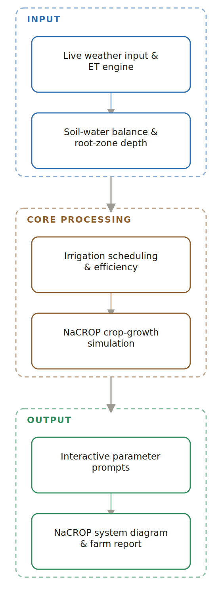

[View interactive graphical walkthrough →](https://halilunaziru73-creator.github.io/NaCROP/)

**Problem.** Knowing how much to irrigate is only half the decision a farmer actually needs: the same weather and soil-water inputs that drive an irrigation schedule should also connect through to a genuine, physically grounded estimate of what that irrigation will produce at harvest, something the earlier ET-and-scheduling-only pipeline stopped short of.

**Methodology.** NaCROP keeps the original ten-equation ET engine, soil-water balance, and irrigation scheduler unchanged, and adds a 4-step crop-growth simulation stage after them: Canopy Cover development, Crop Transpiration (Tr = Ks × KcTr,x × CC* × ET0), above-ground Biomass accumulation (B = WP* × Σ(Tr/ET0)), and final Yield (Y = HI × B). The growth engine reuses this farm's own simulated soil-water depletion to compute a genuine water-stress coefficient (Ks) rather than assuming no stress, and any published crop-science parameter not already carried by the pipeline (plant density, CCx, base temperature, water productivity, harvest index) is asked interactively with a sensible default rather than silently hard-coded.

**Results.** For a 1-hectare maize simulation, the pipeline produced 19,164 kg/ha of total above-ground biomass and 9,199 kg/ha of final yield (48% harvest index), while the underlying seasonal water balance closed to within rounding noise across all 5 crops. Fixing a real bug in root-zone depth (previously fixed at its mature value for the entire season, so nursery and vegetative stages showed zero irrigation need) required a matching fix to the water balance, since newly-accessible deep soil water as roots grow deeper wasn't being counted as a supply term.

## Contents

```
nacrop/                 Core pipeline: ET equations, soil-water balance, irrigation
                         scheduling, efficiency accounting, crop-growth simulation,
                         interactive parameter prompts, NaCROP system diagram
data/                    28-year maize training dataset, weather data
outputs/                 Sample dashboard, tables, and figures
assets/                  App icon
gui.py                   Desktop GUI (Tkinter)
run_pipeline.py          CLI entry point
nacrop.spec              PyInstaller spec for building a standalone desktop app
```

## Download the Desktop App

A packaged Windows desktop app is available, no Python installation required:

**[⬇ Download NaCROP.exe](https://github.com/halilunaziru73-creator/NaCROP/releases/download/v1.1.0/NaCROP.exe)**

(~297 MB, Windows only. Run the .exe directly.)

## How to Run It

```bash
pip install -r requirements.txt
python gui.py
```

Select a crop, enter temperature and humidity, click "Update All Results." Run the
NaCROP Simulation tab for the crop-growth model. Enter the farm owner's name in
Save Farm Report to generate a full Word report.

To build a standalone desktop app: `pyinstaller nacrop.spec`

---

## Sample Report

A full sample farm report generated by NaCROP for a real 20-hectare maize farm. The farm owner's name has been removed and left blank in every figure below; all other figures, numbers, and text are exactly as generated by the app.

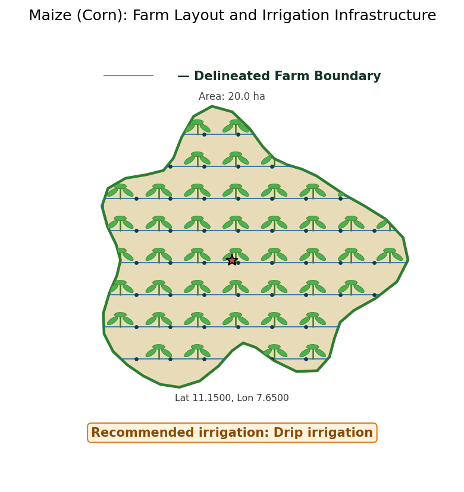
*Farm layout showing the delineated boundary, planted crop, and irrigation infrastructure.*

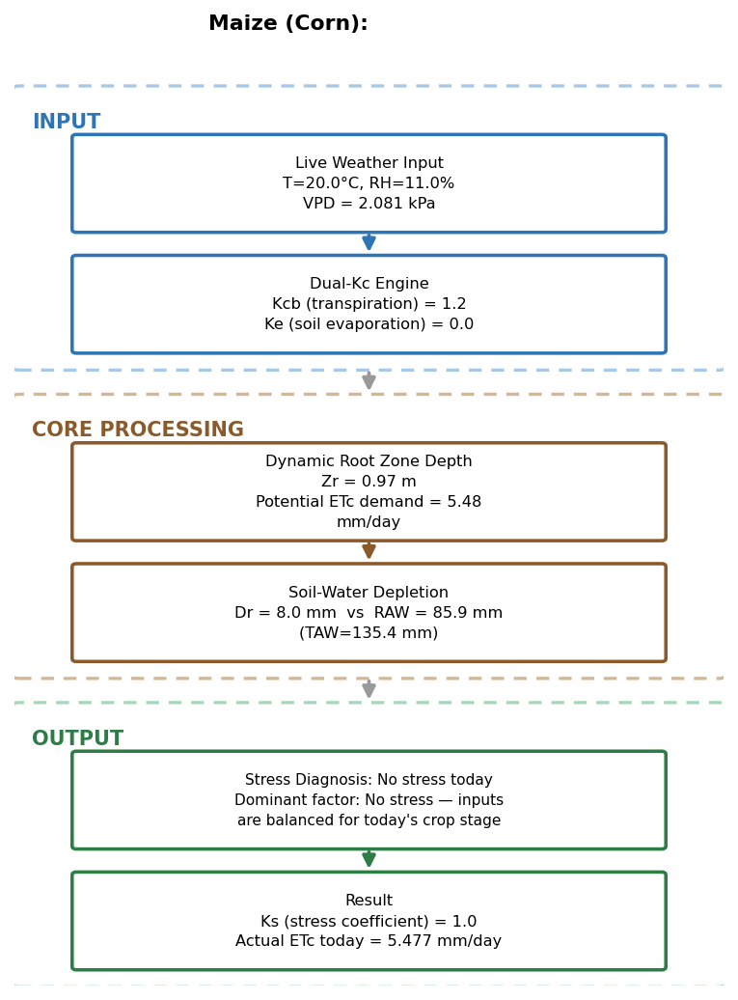
*ET / soil-water decision process for today's inputs.*

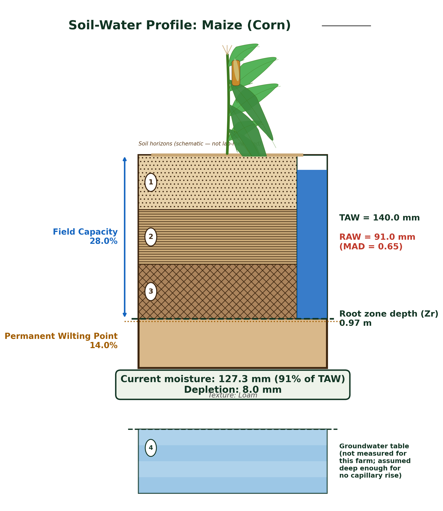
*Soil-water profile for this crop and farm, with the crop root zone and current depletion.*

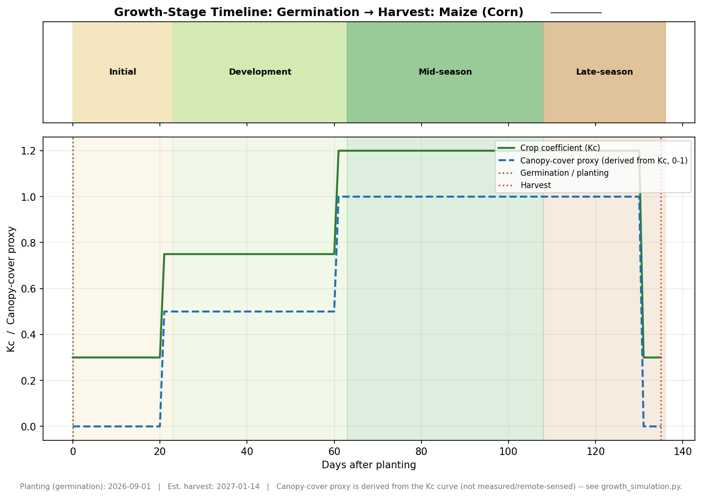
*Growth-stage timeline and canopy-cover proxy, germination to harvest.*

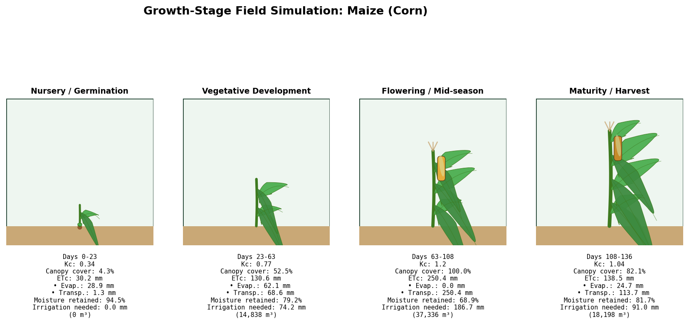
*Field-stage simulation with per-stage water accounting.*

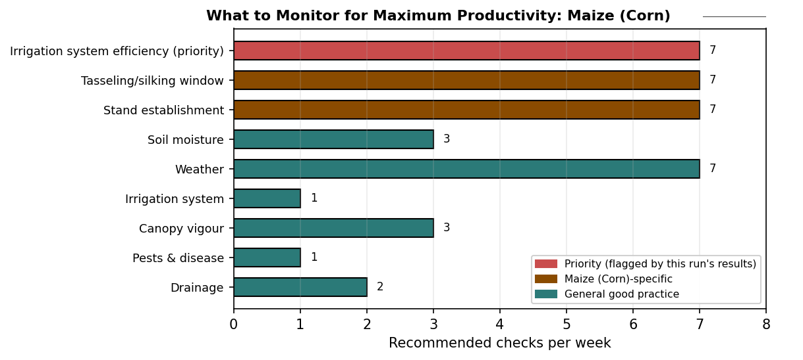
*Recommended monitoring frequency by topic.*

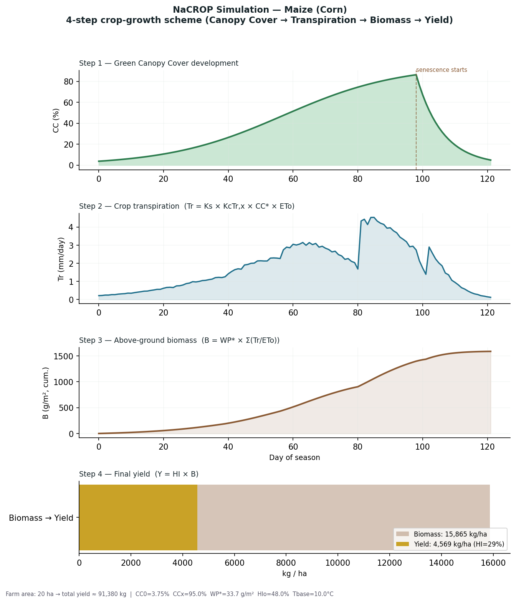
*NaCROP Simulation, maize (corn), this farm's own 4-step crop-growth model.*

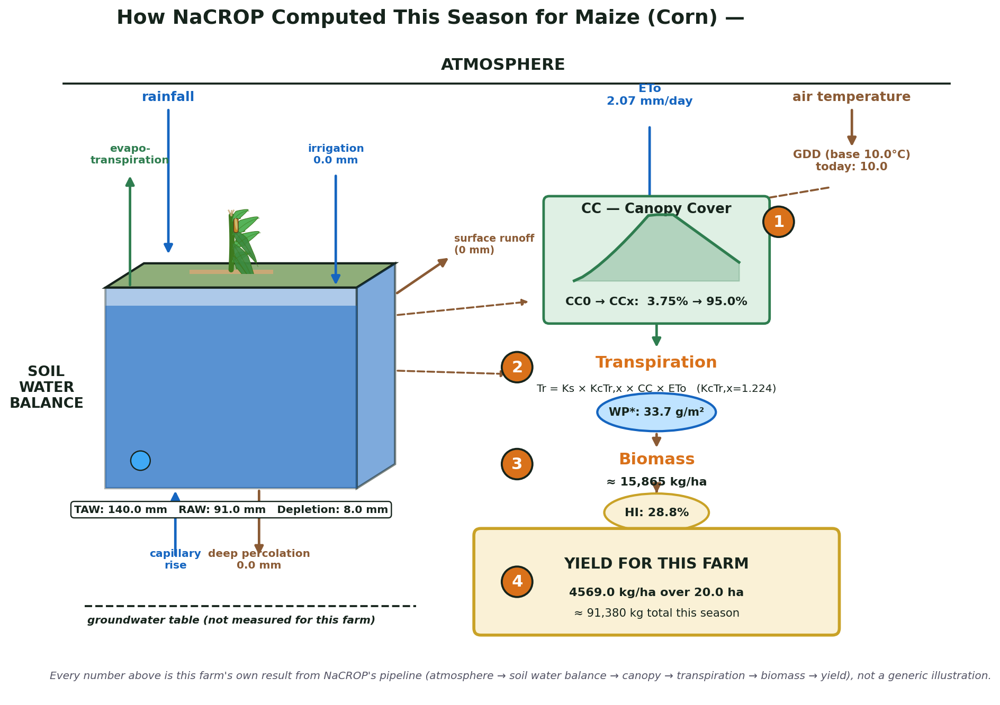
*How NaCROP computed this season for maize (corn), climate and soil water balance driving canopy growth, transpiration, biomass, and final yield.*

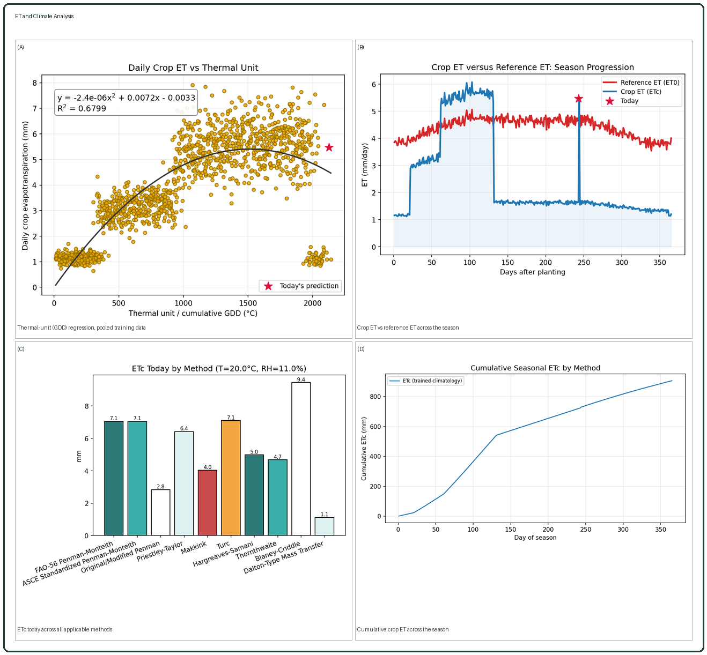
*ET and climate analysis.*

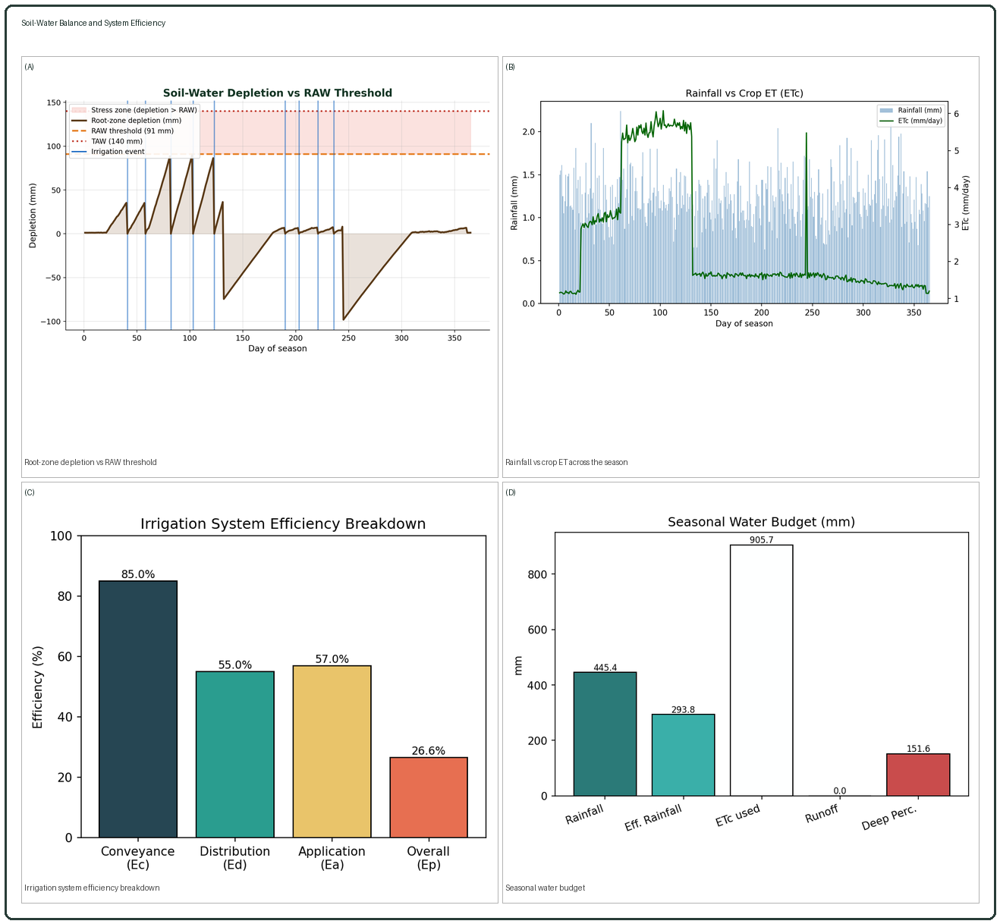
*Soil-water balance and system efficiency.*

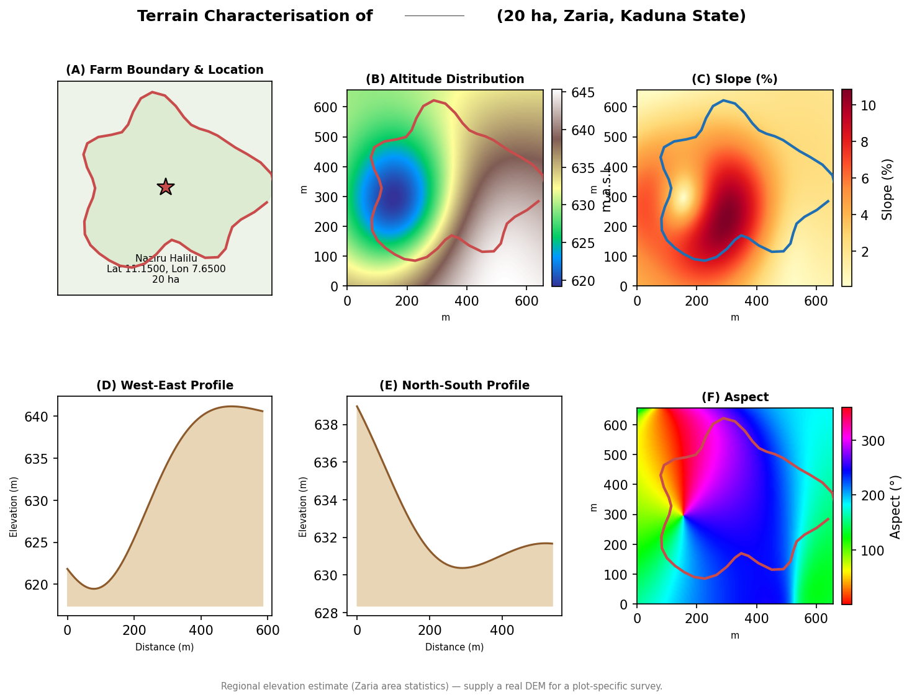
*Terrain characterisation for this farm's own boundary.*


